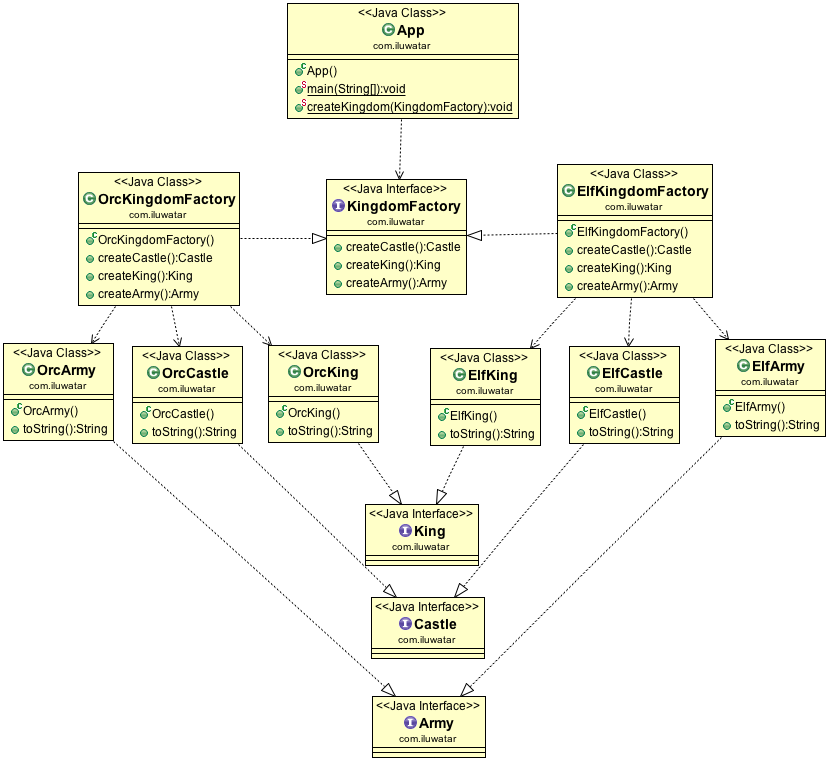

# Abstract Factory

## Intent
Provide an interface for creating families of related or dependent objects without specifying their concrete classes.

## Applicability

- a system should be independent of how its product created, composed and presented.
- a system should be configured one of multiple families of products.
- a families of related product objects is designed to be used together,and you need to enforce this constraint.
- you want to provide a class library of products, and you want to reveal just their interfaces,not their implementations.

